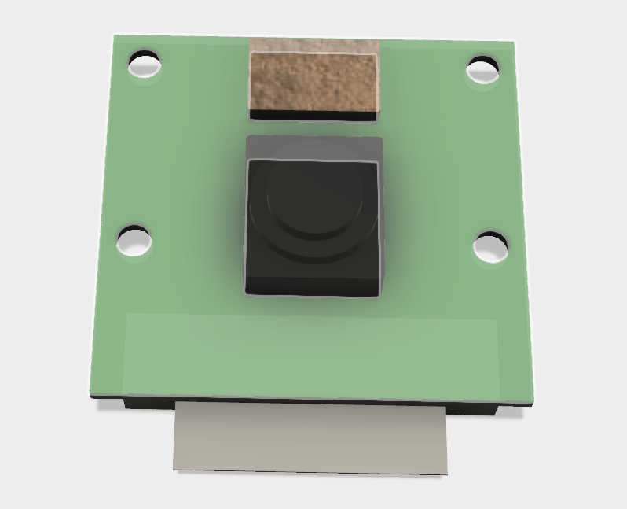

# V3 Hardware

This is the hardware for v3 of the daemon robot. It is a wingless dragon that uses SG90s for its motive power. It has mobile legs

## File Links & Images

### Non 3D printed components

- [Tower Pro SG90 Servo](http://a360.co/2rih2fV) 

- [Raspberry Pi Camera R1.3](http://a360.co/2qzGSv0) 
